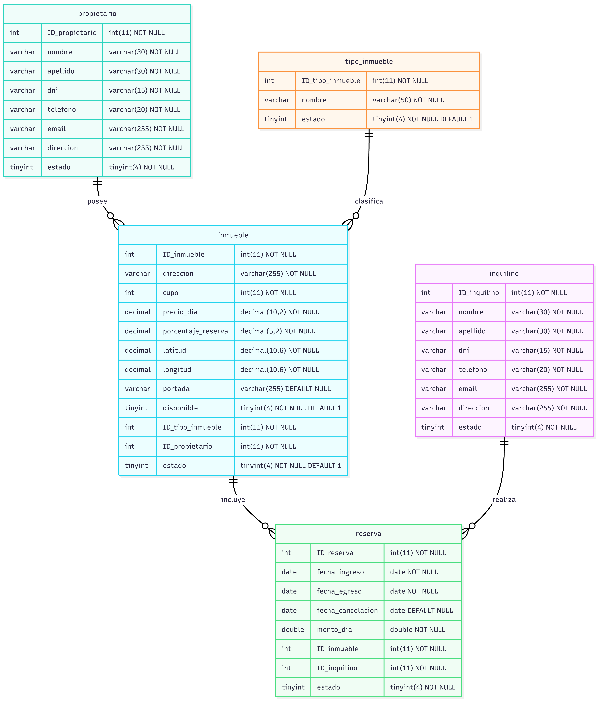

# Agencia Inmobiliaria

Sitio web desarrollado con **ASP.NET Core MVC** para la gestión de una inmobiliaria.

> **Primera entrega:** ABM (Alta, Baja, Modificación) de Propietarios e Inquilinos.
> **Segunda entrega:** ABM (Alta, Baja, Modificación) de Tipos de Inmueble, Inmuebles y Reservas, más las vistas de Detalles de cada entidad.

---

## Integrantes del grupo

| Nombre completo |
|---|
| Rocamora, Marianela |
| Fernández, Rocío |

---

## Tecnologías utilizadas

| Categoría | Tecnología |
|---|---|
| Framework | ASP.NET Core MVC (.NET) |
| Base de datos | MySQL |
| Acceso a datos | ADO.NET (`MySql.Data`) |
| Patrón de acceso a datos | Repository |
| Mapas | Leaflet + OpenStreetMap |

---

## Herramientas de desarrollo

| Herramienta | Uso |
|---|---|
| [Visual Studio Code](https://code.visualstudio.com/) | Editor principal del proyecto |
| [.NET SDK](https://dotnet.microsoft.com/download) | Compilación y ejecución del proyecto ASP.NET Core |
| [XAMPP](https://www.apachefriends.org/) | Servidor local MySQL/MariaDB + phpMyAdmin |
| [GitHub Desktop](https://desktop.github.com/) | Control de versiones y colaboración en equipo |

---

## Paquetes NuGet utilizados

| Paquete | Función |
|---|---|
| `MySql.Data` | Conector ADO.NET para conectar la app con MySQL |

Para instalarlo manualmente:

```bash
dotnet add package MySql.Data
```

---

## Instrucciones para levantar la base de datos

### Requisitos previos

- Tener **XAMPP** instalado (o cualquier servidor MySQL/MariaDB local).
- Tener el módulo **MySQL** de XAMPP corriendo (puerto por defecto: `3306`).

### Pasos

1. Iniciar **MySQL** desde el Panel de Control de XAMPP.
2. Abrir **phpMyAdmin** desde [`http://localhost/phpmyadmin`](http://localhost/phpmyadmin).
3. Crear una base de datos nueva llamada **`inmobiliaria`**.
4. Entrar a la base `inmobiliaria` y abrir la pestaña **Importar**.
5. Seleccionar el archivo `inmobiliaria.sql` de este repositorio y hacer clic en **Continuar**.
6. Verificar en la pestaña **Estructura** que se hayan creado las 5 tablas: `propietario`, `inquilino`, `tipo_inmueble`, `inmueble` y `reserva`.

---

## Configuración de la cadena de conexión

En `appsettings.json`, verificar que la cadena de conexión apunte a la base local:

```json
"ConnectionStrings": {
  "DefaultConnection": "Server=localhost;Port=3306;Database=inmobiliaria;Uid=root;Pwd=;"
}
```

> Esta es la configuración por defecto de XAMPP (usuario `root` sin contraseña).
> Si tu instalación de MySQL usa otro usuario o contraseña, ajustar estos valores.

---

## Cómo correr el proyecto

```bash
dotnet run
```

Luego abrir en el navegador la URL que indique la consola y navegar a:

| Ruta | Descripción |
|---|---|
| `/Inquilino` | ABM de Inquilinos |
| `/Propietario` | ABM de Propietarios |
| `/TipoInmueble` | ABM de Tipos de Inmueble |
| `/Inmueble` | ABM de Inmuebles (incluye Detalles y mapa para coordenadas) |
| `/Reserva` | ABM de Reservas (incluye Detalles, Extender y Cancelar) |

---

## Novedades de la segunda entrega

- **ABM completo de Tipo de Inmueble**: alta, baja (cambio de estado), modificación y listado.
- **ABM completo de Inmueble**: alta, baja, modificación, listado paginado y vista de **Detalles** (con el nombre del Tipo de Inmueble y del Propietario resueltos, no solo el ID).
  - Combos de Tipo de Inmueble y Propietario en el formulario.
  - Selección de coordenadas mediante un **mapa interactivo** (Leaflet + OpenStreetMap): se hace clic en el punto deseado y se completan Latitud/Longitud automáticamente.
  - Validaciones de rango en los campos numéricos (cupo, precio por día, % de reserva, latitud, longitud).
- **ABM completo de Reserva**: alta, baja, modificación, listado y vista de **Detalles**.
  - Acción **Extender**: genera una nueva reserva a partir de una existente, sin modificar la original, con el mismo inquilino e inmueble.
  - Acción **Cancelar**: registra la fecha de cancelación y calcula la multa correspondiente según el tiempo cumplido de la reserva.
- **Paginado por servidor** (10 registros por página, con `LIMIT`/`OFFSET`) en los listados de Inmueble y demás entidades, con botonera de navegación.
- Script `inmobiliaria.sql` actualizado con las 5 tablas y sus claves foráneas.

---

## Diagrama Entidad-Relación

